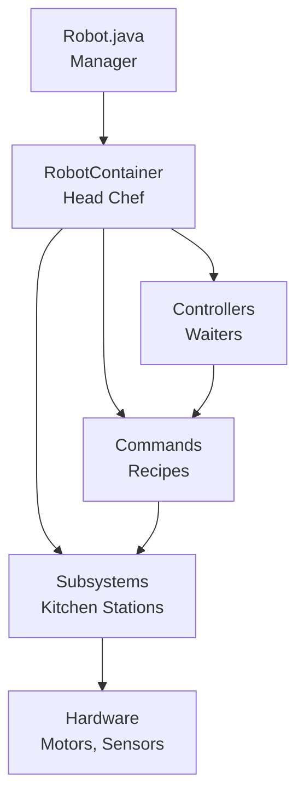

# Robot Codebase Overview - ELI5 Edition
## (Explain Like I'm 5... or a High School Student!)

Welcome! This document explains our robot's code in simple terms. Think of it like a tour guide for the codebase.

---

## What is This Codebase?

This is the **brain** of our FRC robot. Just like your brain controls your body, this code controls the robot. It tells the robot:
- How to move around
- How to pick up game pieces (coral)
- How to score them
- How to see where it is on the field
- What to do automatically

---

## The Big Picture: How Everything Fits Together

Think of the robot code like a **restaurant**:

- **Robot.java** = The restaurant manager (runs everything)
- **RobotContainer.java** = The head chef (organizes all the parts)
- **Subsystems** = Different kitchen stations (drivetrain, arm, elevator, etc.)
- **Commands** = Recipes (step-by-step instructions)
- **Controllers** = The waiters (take orders from drivers)
- **State Machine** = The menu (what the robot can do)



---

## Main Files Explained

### 1. `Robot.java` - The Manager

**What it does**: This is the boss. It runs 50 times per second (every 20 milliseconds) and makes sure everything happens in the right order.

**Think of it like**: A clock that ticks 50 times per second, checking "What should the robot do now?"

**Key parts**:
- `robotPeriodic()` - Runs constantly, like a heartbeat
- `autonomousInit()` - Starts autonomous mode
- `teleopInit()` - Starts driver control mode

**Location**: `src/main/java/frc/robot/Robot.java`

---

### 2. `RobotContainer.java` - The Head Chef

**What it does**: Sets up everything when the robot turns on. It creates all the subsystems, connects controllers, and prepares autonomous routines.

**Think of it like**: A chef who sets up all the kitchen stations before the restaurant opens.

**What it creates**:
- All subsystems (drivetrain, climber, intake, shooter, etc.)
- Controller bindings (which button does what)
- Autonomous routines
- Vision system

**Note**: Currently many subsystems are commented out for drivetrain-only testing. See `SubsystemFactory.java` for details.

**Location**: `src/main/java/frc/robot/RobotContainer.java`

---

### 3. Subsystems - The Kitchen Stations

Subsystems are the different parts of the robot that do specific jobs. Each one is like a station in a kitchen.

#### **Drivetrain** (`CommandSwerveDrivetrain`)
- **What it does**: Makes the robot move around
- **Think of it like**: The wheels of a car
- **Special feature**: Swerve drive (wheels can turn independently!)
- **Location**: `src/main/java/frc/robot/SwerveDrivetrain/`

#### **Climber** (`Climber.java`)
- **What it does**: Helps the robot climb at the end of the match
- **Think of it like**: A ladder
- **Location**: `src/main/java/frc/robot/Subsystems/Climber.java`

#### **DeployableIntake** (`DeployableIntake.java`)
- **What it does**: Picks up game pieces from the ground
- **Think of it like**: A vacuum cleaner that can extend and retract
- **Location**: `src/main/java/frc/robot/Subsystems/DeployableIntake.java`

#### **Floor** (`Floor.java`)
- **What it does**: Moves game pieces from intake to feeder
- **Think of it like**: A conveyor belt
- **Location**: `src/main/java/frc/robot/Subsystems/Floor.java`

#### **Feeder** (`Feeder.java`)
- **What it does**: Moves game pieces from floor to shooter
- **Think of it like**: A second conveyor belt
- **Location**: `src/main/java/frc/robot/Subsystems/Feeder.java`

#### **Shooter** (`Shooter.java`)
- **What it does**: Shoots game pieces at high speed
- **Think of it like**: A cannon
- **Location**: `src/main/java/frc/robot/Subsystems/Shooter.java`

#### **Lights** (`Lights.java`)
- **What it does**: Controls LED lights on the robot
- **Think of it like**: A light switch
- **Location**: `src/main/java/frc/robot/Subsystems/Lights.java`

#### **PhotonVision** (`PhotonVision.java`)
- **What it does**: Uses a camera to see AprilTags and figure out where the robot is
- **Think of it like**: The robot's eyes
- **Location**: `src/main/java/frc/robot/Subsystems/Cameras/PhotonVision.java`

**Note**: Many of these subsystems are currently commented out for drivetrain-only testing. See `SubsystemFactory.java` for the current state.

---

### 4. Commands - The Recipes

Commands are step-by-step instructions that tell subsystems what to do. They're like recipes that combine multiple actions.

**Example**: "Pick up coral" command might:
1. Deploy the intake
2. Turn on the intake motors
3. Turn on the floor conveyor
4. Wait until sensor detects coral
5. Retract the intake

#### **RobotCommands** (`RobotCommands.java`)
- **What it does**: Factory class that creates common commands
- **Think of it like**: A cookbook with pre-made recipes
- **Examples**: `prepareScoreCoralCommand()`, `intakeCoralCommand()`
- **Location**: `src/main/java/frc/robot/Commands/RobotCommands.java`
- **Note**: Most methods are currently commented out for 2026 as Elevator, Arm, and SideToSide subsystems were removed

---

### 5. State Machine - The Menu

**What it does**: Tracks what the robot is currently doing and what it's allowed to do next.

**Think of it like**: A menu at a restaurant - you can only order things that are on the menu, and some items require you to have finished others first.

**States** (what the robot can be doing):
- **PreIntake**: Getting ready to pick up coral
- **Intake**: Picking up coral
- **PostIntake**: Finished picking up, moving to scoring position
- **PrepareScore**: Getting ready to score
- **Score**: Actually scoring

**Location**: `src/main/java/frc/robot/State/StateMachine.java`

---

### 6. PositionTracker - The Memory

**What it does**: Remembers where all the robot parts are and what sensors are reading.

**Think of it like**: A notebook that tracks:
- "Climber is at position 2.5"
- "Intake is deployed: YES"
- "Coral is in the tray: YES"
- "Shooter speed: 5000 RPM"

**Location**: `src/main/java/frc/robot/PositionTracker.java`

---

### 7. Autonomous (Auto) - The Robot Driver

**What it does**: Makes the robot drive itself during the first 15 seconds of the match.

**Think of it like**: Autopilot on an airplane - the robot follows a pre-programmed path.

#### **AutoManager** (`AutoManager.java`)
- **What it does**: Manages which autonomous routine to run
- **Location**: `src/main/java/frc/robot/Auto/AutoManager.java`

#### **AutoRoutine** (`AutoRoutine.java`)
- **What it does**: Defines a specific autonomous sequence
- **Location**: `src/main/java/frc/robot/Auto/AutoRoutine.java`

**How it works**:
1. Driver selects an auto routine on the dashboard
2. Match starts
3. Robot follows the path automatically
4. After 15 seconds, drivers take control

For a detailed description of each routine (ClimberAuto, ShooterAuto) and step-by-step behavior, see [Autonomous Routines](autonomous_routines.md).

---

## How Code Flows (The Restaurant Analogy)

### When a Driver Presses a Button:

1. **Controller** (waiter) receives the button press
2. **BindingConfigurator** (head waiter) looks up what that button should do
3. **Command** (recipe) is created and scheduled
4. **Command Scheduler** (kitchen manager) runs the command
5. **Subsystem** (kitchen station) executes the action
6. **Hardware** (appliances) actually moves

### Example: Driver presses "Score Coral" button

```
Driver presses button
    ↓
BindingConfigurator says "That's the score button!"
    ↓
Creates prepareScoreCoralCommand()
    ↓
Command checks StateMachine: "Can we score?" 
    ↓
If yes: Spins up shooter, feeds game piece, shoots
    ↓
Hardware motors move the mechanisms
    ↓
Robot scores!
```

---

## Important Concepts

### Command-Based Programming

**What it is**: Instead of directly controlling motors, we create "commands" that do tasks.

**Why it's good**: 
- Commands can be combined (like LEGO blocks)
- Easy to test
- Can be interrupted and resumed

**Example**: Instead of "set motor speed to 0.5", we say "run IntakeCommand" which handles all the details.

### State Machine

**What it is**: A system that tracks what the robot is doing and prevents invalid actions.

**Why it's good**:
- Prevents the robot from trying to score when it has no coral
- Ensures mechanisms move in the right order
- Makes the code safer and more predictable

### Vision System

**What it is**: The robot uses a camera (PhotonVision) to see AprilTags on the field.

**What AprilTags are**: Special QR-code-like markers placed around the field that tell the robot where it is.

**How it works**:
1. Camera sees AprilTag
2. PhotonVision calculates robot position
3. Position is fused with wheel odometry (dead reckoning)
4. Robot knows exactly where it is on the field

---

## File Structure

```
src/main/java/frc/robot/
├── Robot.java                    # Main entry point
├── RobotContainer.java           # Sets up everything
├── SubsystemFactory.java         # Creates all subsystems
├── BindingConfigurator.java     # Maps buttons to commands
├── AutoConfigurator.java         # Sets up autonomous
│
├── Commands/                     # All commands
│   ├── BaseCenterToCommand.java  # Reusable centering command
│   ├── CenterToReefCommand.java  # Centers to reef
│   ├── RobotCommands.java       # Command factory
│   └── RobotContext.java        # Shared data for commands
│
├── Subsystems/                    # All robot parts
│   ├── Climber.java
│   ├── DeployableIntake.java
│   ├── Floor.java
│   ├── Feeder.java
│   ├── Shooter.java
│   ├── Lights.java
│   └── Cameras/
│       └── PhotonVision.java
│
├── Auto/                          # Autonomous code
│   ├── AutoManager.java
│   └── AutoRoutine.java
│
├── State/                         # State machine
│   └── StateMachine.java
│
├── Constants/                     # All configuration values
│   ├── CANIds.java
│   ├── DigitalInputIds.java
│   ├── VisionConstants.java
│   └── ...
│
└── SwerveDrivetrain/             # Drivetrain code
    └── CommandSwerveDrivetrain.java
```

---

## Common Tasks for New Students

### "I want to add a new button binding"

1. Open `BindingConfigurator.java`
2. Find the section for the controller you want
3. Add a new binding like: `controller.button().onTrue(new YourCommand())`

### "I want to create a new command"

1. Create a new file in `src/main/java/frc/robot/Commands/`
2. Extend `Command` class
3. Add the subsystems you need in constructor
4. Implement `execute()`, `isFinished()`, `end()`

### "I want to change how the robot moves"

1. Look at `SwerveDrivetrainBindings.java` for driver controls
2. Look at `CommandSwerveDrivetrain.java` for drivetrain behavior
3. Look at `DrivetrainConstants.java` for tuning values

### "I want to add a new autonomous routine"

1. Create a path in PathPlanner (the GUI tool)
2. Add it to `AutoConfigurator.java`
3. Register it with `AutoManager`

---

## Key Takeaways

1. **Robot.java** runs everything 50 times per second
2. **Subsystems** are the robot's body parts (drivetrain, climber, intake, shooter, etc.)
3. **Commands** are recipes that tell subsystems what to do
4. **State Machine** prevents the robot from doing invalid things
5. **Vision** helps the robot know where it is on the field
6. **Autonomous** makes the robot drive itself for the first 15 seconds

**Note**: This codebase is for the 2026 REBUILT game. Many subsystems are currently commented out for drivetrain-only testing. Game element terminology (Coral, Reef) is still used in code but should be updated to FUEL and HUB per the migration plan in `docs/update_codebase_for_2026_rebuilt_game.md`.

---

## Getting Help

- **Read the code comments**: Most files have JavaDoc explaining what they do
- **Check the docs folder**: There are architecture documents
- **Ask questions**: Don't be afraid to ask mentors or other students!
- **Start small**: Pick one subsystem and understand it fully before moving on

---

## Next Steps

1. **Read `Robot.java`** - Understand the main loop
2. **Read `RobotContainer.java`** - See how everything is set up
3. **Pick one subsystem** - Read its code and understand it
4. **Try a small change** - Add a button binding or modify a command
5. **Test in simulation** - Use WPILib simulation to test without hardware

Remember: **Everyone starts as a beginner!** The code might look scary at first, but it's just a bunch of small pieces working together. Take it one piece at a time, and you'll understand it in no time! 🚀
